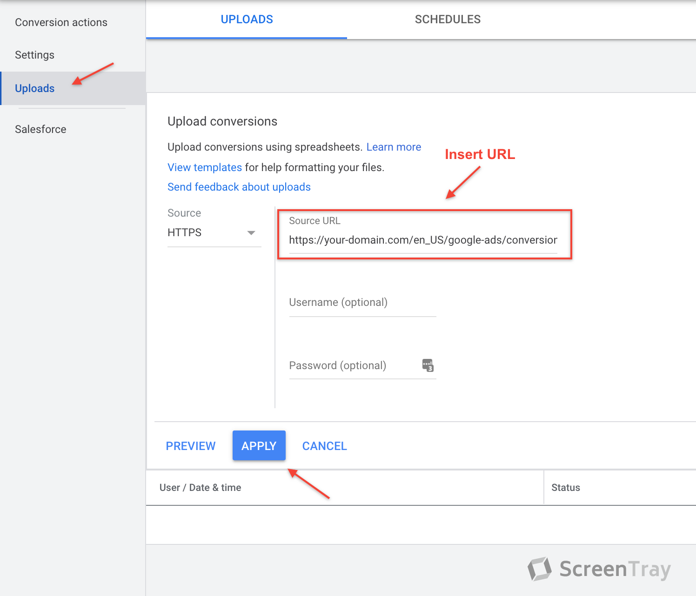

# Sylius plugin for Google Ads

[![Latest Version][ico-version]][link-packagist]
[![Latest Unstable Version][ico-unstable-version]][link-packagist]
[![Software License][ico-license]](LICENSE)
[![Build Status][ico-github-actions]][link-github-actions]

This plugin tracks conversions in your Sylius store. It's done with [offline conversion tracking](https://support.google.com/google-ads/answer/2998031?hl=en)
instead of the default javascript tracking. It has a few benefits to do this:
- Easier to control the consent status for a given user
- Easier to change the value of a given order after the fact
- No javascripts on your page to track Google Ads, which means faster page load

## Installation

### Step 1: Install and enable plugin

```bash
$ composer require setono/sylius-google-ads-plugin
```

Add the bundle to your `config/bundles.php` before the `SyliusGridBundle`:

```php
<?php
# config/bundles.php

return [
    // ...
    
    Setono\SyliusGoogleAdsPlugin\SetonoSyliusGoogleAdsPlugin::class => ['all' => true], // Added before the grid bundle
    Sylius\Bundle\GridBundle\SyliusGridBundle::class => ['all' => true],
    
    // ...
];
```

That's it!

## Usage

Offline conversion tracking works like this:

1. We collect the `gclid` query parameter when a user enters the store from clicking on an ad. We save this value in a cookie.
2. When the same user completes a purchase, we will insert a new row into our `conversion` table.
3. We then expose these conversions as CSV data on a URL that you grab in the backend. This URL is then used when setting
up the conversion action inside the Google Ads interface.
   
### Step 1: Set up a new conversion action in Sylius
1. Go to `/admin/conversion-actions/new` and create a new conversion action. There's a help text on the right explaining
how to do it.
   
2. When you have created your conversion, you go to the conversion action index (`/admin/conversion-actions/`) where you
find the URL you need to give to Google. It will look something like: `https://your-domain.com/en_US/google-ads/conversions/af5717388cb5a610b92c9da43914384cfa8a491e5999e4e9c4e9e0b32204b0dc`
   
### Step 2: Set up a matching conversion action in Google Ads
1. Create a new conversion action inside the Google Ads interface.
2. Name it the same as you did in Sylius. This is **important** since Google matches the name.
3. Create a new upload of conversions. See the image below:




[ico-version]: https://poser.pugx.org/setono/sylius-google-ads-plugin/v/stable
[ico-unstable-version]: https://poser.pugx.org/setono/sylius-google-ads-plugin/v/unstable
[ico-license]: https://poser.pugx.org/setono/sylius-google-ads-plugin/license
[ico-github-actions]: https://github.com/Setono/SyliusGoogleAdsPlugin/workflows/build/badge.svg

[link-packagist]: https://packagist.org/packages/setono/sylius-google-ads-plugin
[link-github-actions]: https://github.com/Setono/SyliusGoogleAdsPlugin/actions
